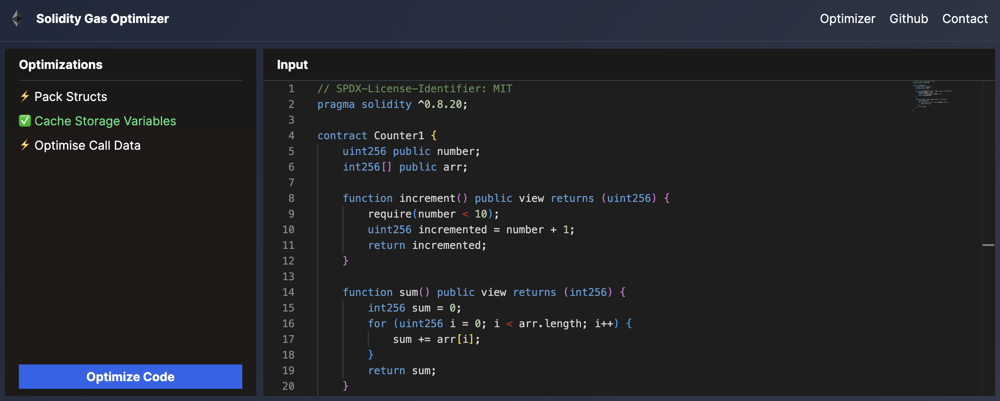

# Solidity-Gas-Optimizoor



An high performance automated tool that optimizes gas usage in Solidity smart contracts, focusing on storage and function call efficiency.

For more information on architecture and implementation, see the [docs](docs.md)

> [!WARNING]
> This code is a work in progress and can contain bugs. Use it at your own risk. Feature request and bug reports are welcome.


Dev Writeup for design, architecture and process can be found [here](https://extremelysunnyyk.medium.com/from-idea-to-implementation-creating-a-solidity-gas-optimizer-for-smart-contracts-0a103c2bfd24)

## Requirements

- `>= go1.22.2` [link](https://go.dev/doc/install)
- `>= node 18` [link](https://nodejs.org/en/download)
- `foundryup` [link](https://book.getfoundry.sh/getting-started/installation)
- `make`
- `tmux` (optional)

## Installation

1. Clone the Repository

```bash
git clone --recurse-submodules https://github.com/yongkangc/solidity-optimiser-app.git
```

2. Build the Go Project by running `make build`

> [!NOTE]
> Check out the [installation guide](installation.md) for detailed instructions on setting up the project.

## Usage

- **CLI**: run `./build/optimizer --help` in project root to get started with the CLI tool.
- **Web App**: run `make start` to start the backend and frontend with tmux.
  - View the frontend at `http://localhost:3000`

> [!NOTE]
> More information at [usage guide](usage.md).

## Running Tests

```bash
make optimizer-test
```

---

## Project Information

**Problem Statement:**

Solidity developers need tools to help them write gas-efficient code to minimize the execution cost of smart contracts on the blockchain. While there are some linters and optimizers available, there's a lack of tools specifically designed to analyze and suggest optimizations at both the source code and intermediate representation levels.

**Project Objective:**

The goal of this project is to design and implement a CLI and Web app that analyzes Solidity smart contracts, identifies patterns that lead to high gas usage, and suggests or automatically applies optimizations to improve gas efficiency.

## How does our tool optimize the gas of your smart contracts?

> [!TIP]
> See some examples [here](optimisations.md).

### Struct Data Packing

- **Concept**: Aligning struct members under 32 bytes together optimizes storage usage on the EVM.
- **Advantages**: This technique minimizes the number of `SLOAD` or `SSTORE` operations, slashing storage interaction costs by 50% or more when dealing with multiple struct values within a single slot.
- **Documentation**: [Structured Data Packing Guidance](https://github.com/beskay/gas-guide/blob/main/OPTIMIZATIONS.md#storage-packing)

[Demo](https://www.youtube.com/watch?v=cm8SGd2WK24&ab_channel=YongKangChia)

### Caching Storage Variables

- **Approach**: Utilize local variables to cache frequently accessed storage variables, reducing the number of expensive storage reads and writes.
- **Details**: Create a temporary local variable to store the value of a storage variable if it's accessed multiple times.
- **Source**: [Caching Storage Variables](https://www.rareskills.io/post/gas-optimization#viewer-8lubg)

### Calldata Efficiency

- **Gas Savings**: Leveraging calldata for unaltered external function inputs is more cost-effective than utilizing memory.
- **Implementation**: Analyze functions to ensure that inputs declared as `memory` are not modified. If unmodified, convert to `calldata`.
- **Reference**: [Calldata Efficiency Tips](https://github.com/beskay/gas-guide/blob/main/OPTIMIZATIONS.md#calldata-instead-of-memory-for-external-functions)
